# CareConnect

Care Connect - Community Circle

## Live Demo

Demo account: 
<br>
email: "john.doe@example.com"
password: "johnpassword123"


Check out the live demo of the app: [](https://care-connect-378fa5174d96.herokuapp.com/)
<br>
Presentation Slides: [](https://docs.google.com/presentation/d/1RjIZjl0G9_lSB3-7fKbuHJAO_isZM33KwT34OEkrZ9s/edit#slide=id.g27caa58f48d_3_959)
<br>
GitHub Repo: [](https://github.com/jenho-webdev/CareConnect)

## Tech Stack


## Table of Contents

- [CareConnect](#careconnect)
  - [Live Demo](#live-demo)
  - [Tech Stack](#tech-stack)
  - [Table of Contents](#table-of-contents)
  - [Description](#description)
  - [User Story](#user-story)
  - [Requirements](#requirements)
  - [Key Features](#key-features)
  - [Wireframes](#wireframes)
  - [Screen Shots](#screen-shots)
  - [Collaborators](#collaborators)
  - [Contributing](#contributing)
  - [License](#license)
  - [Disclaimer](#disclaimer)

## Description

CareConnect is a dedicated community-based application designed to bridge the gap between those who need assistance and those willing to offer a helping hand within their local community. Serving the sick, elderly, disabled, moms, and more, this platform empowers users to request specific help, whether it's a ride to a doctor's appointment, a meal, or tech assistance. By integrating shared calendar and posts features, CareConnect enhances the connection between community members. Allowing users to plan, volunteer, and coordinate assistance seamlessly.

- What was your motivation? The motivation behind creating CareConnect a community-based application is driven by a desire to build stronger and more supportive local communities. This platform aims to leverage technology to facilitate connections between individuals who can provide assistance and those who require it.

- Why did you build this project? To foster a sense of community and neighborly support in an increasingly digital and disconnected world. To empower individuals to seek and offer help, encouraging a culture of mutual assistance and kindness. To provide a platform that makes it easier for people, especially those with specific needs like the sick, elderly, or disabled, to access the help and services they require.
  
- What problem does it solve? Many individuals, especially seniors and people with disabilities, can experience social isolation. CareConnect helps combat this by connecting them with volunteers and support within their community. Sometimes, individuals struggle to access necessary services, such as transportation to medical appointments or assistance with daily tasks. CareConnect fills this gap by facilitating connections between those in need and willing helpers. The project encourages community members to actively engage with and support one another, fostering a sense of belonging and unity.Caregivers, volunteers, and those needing assistance can use the calendar and posts to feature coordinated tasks and stay organized, ensuring that help is provided effectively.
  
- What did you learn? Projects like CareConnect are motivated by a desire to strengthen communities, empower individuals, and address specific challenges related to accessibility and support. Through these initiatives, valuable insights are gained about community dynamics, user-centered design, and the power of technology to facilitate local connections and assistance.
  
## User Story

```
AS a member of the Care Connect Community Circle, 
I WANT to use the app to connect with fellow caregivers and individuals in similar caregiving situations 
SO THAT they can share experiences, exchange advice, and offer support.
```

## Requirements

```
Use React for the front end.
Use GraphQL with a Node.js and Express.js server.
Use MongoDB and the Mongoose ODM for the database.
Use queries and mutations for retrieving, adding, updating, and deleting data.
Be deployed using Heroku (with data).
Have a polished UI.
Be responsive.
Be interactive (i.e., accept and respond to user input).
Include authentication (JWT).
Protect sensitive API key information on the server.
Have a clean repository that meets quality coding standards (file structure, naming conventions, best practices for class and id naming conventions, indentation, high-quality comments, and so on).
Have a professional README (with unique name, description, technologies used, screenshot, and link to deployed application).
```


## Key Features

- **Request Assistance:** Users can request specific types of help, such as rides, meal deliveries, or tech support.
- **Offer Assistance:** Individuals can volunteer their time and skills to assist others in their community.
- **Shared Calendar:** A shared calendar enables users to coordinate tasks and appointments efficiently.
- **Community Posts:** Users can engage in discussions, share resources, and connect with others through community posts.
- **Privacy and Security:** CareConnect prioritizes user privacy and data security.

## Wireframes

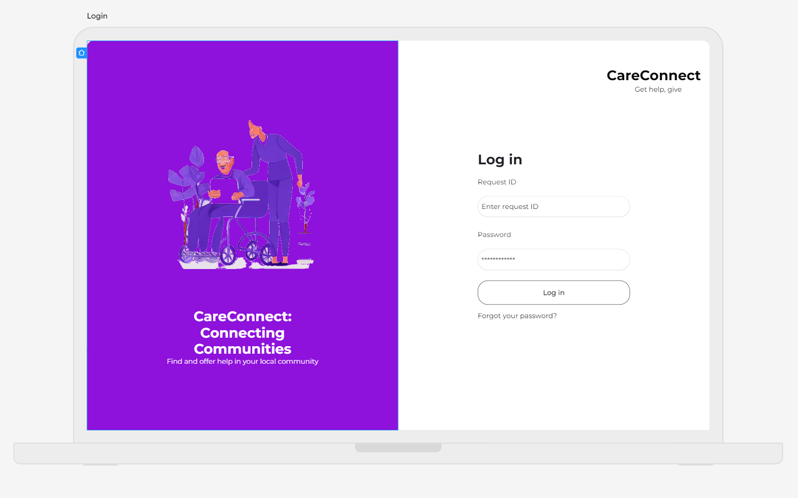
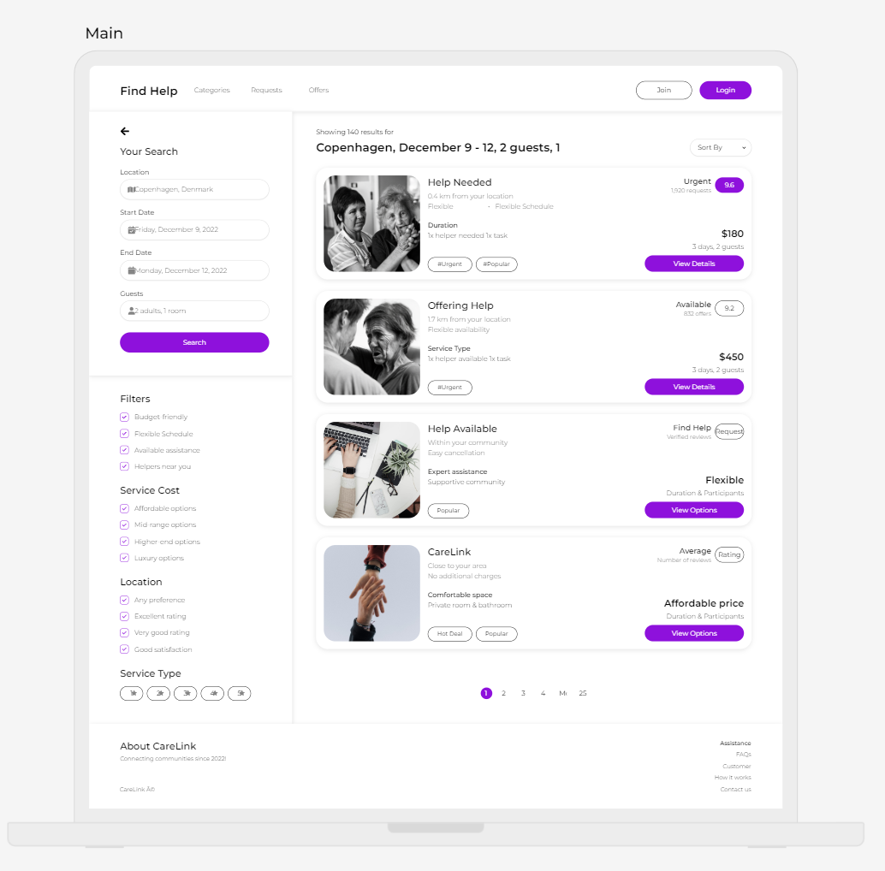
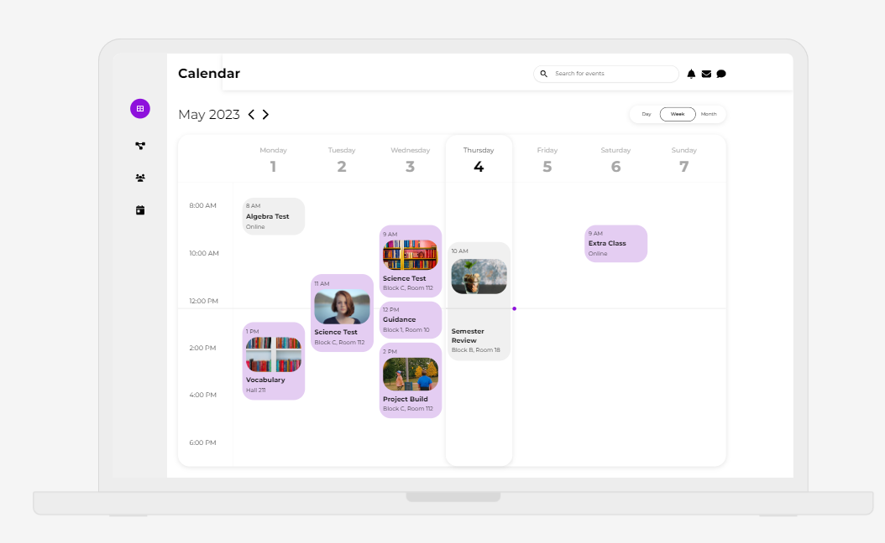
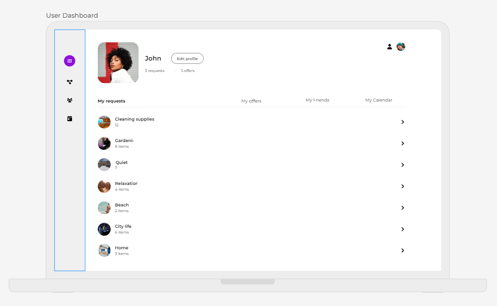
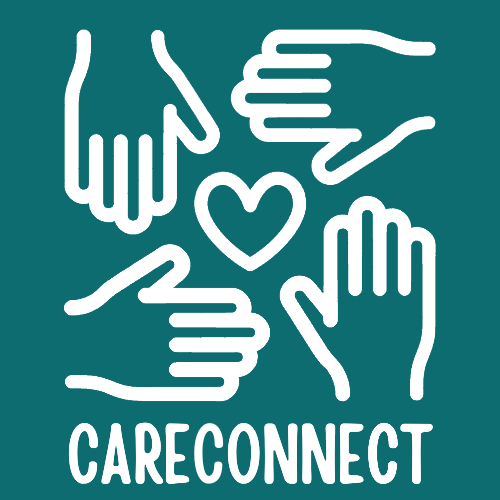


## Screen Shots

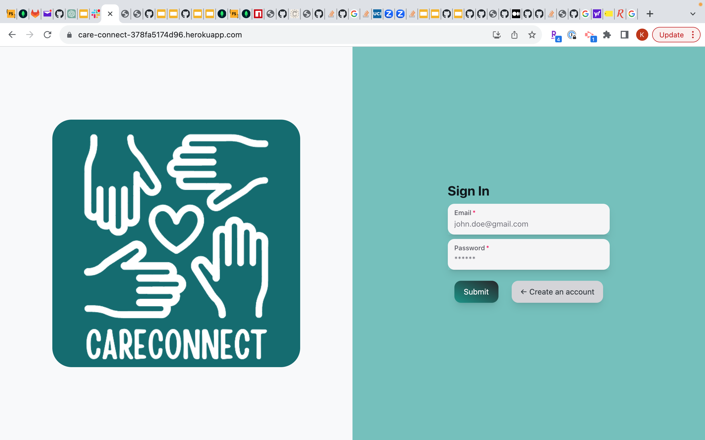
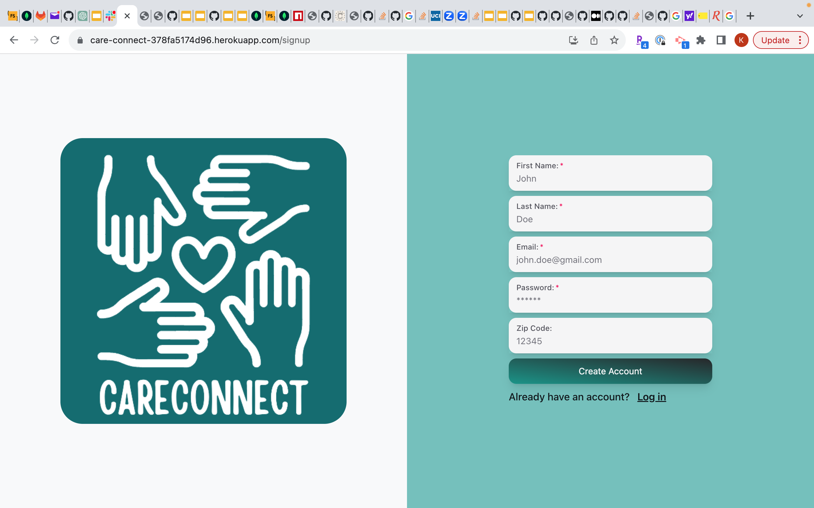
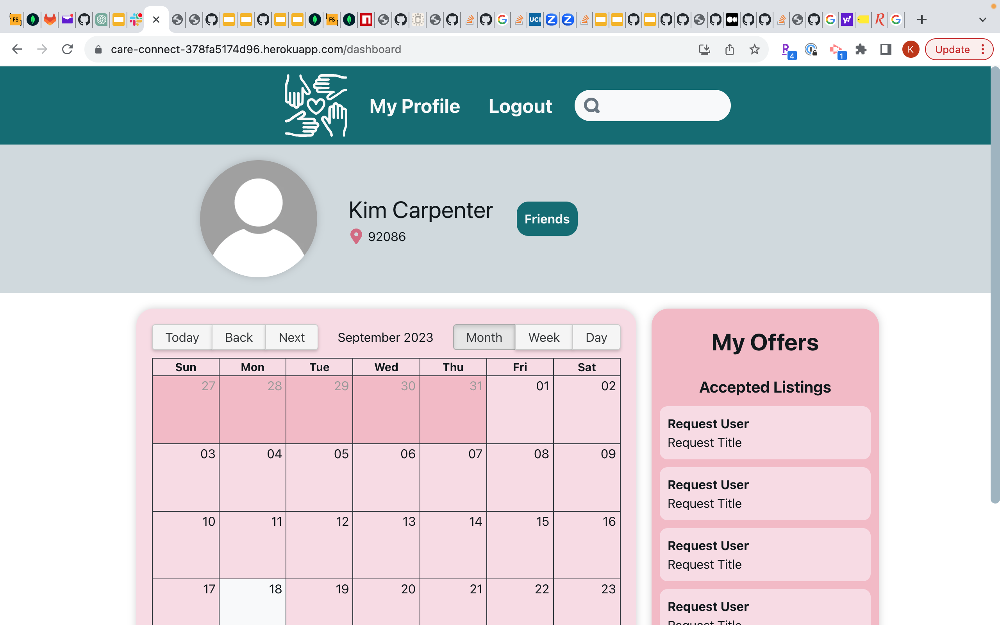
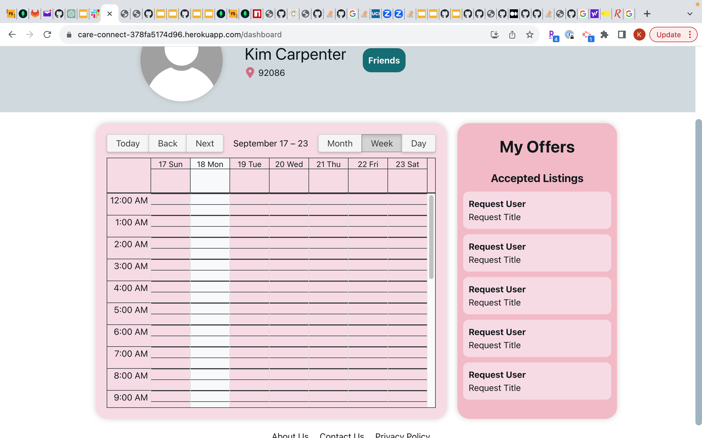
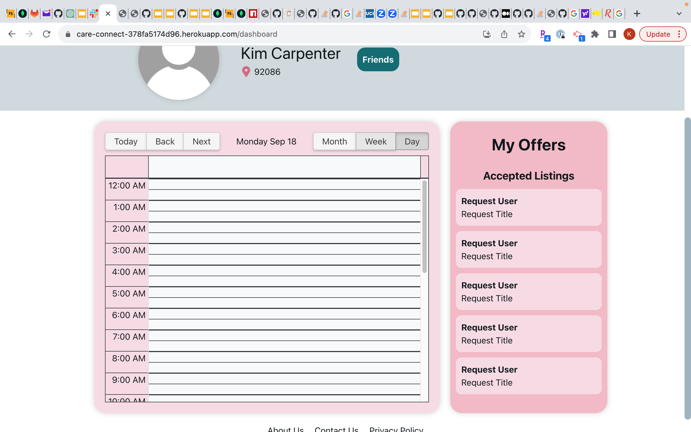

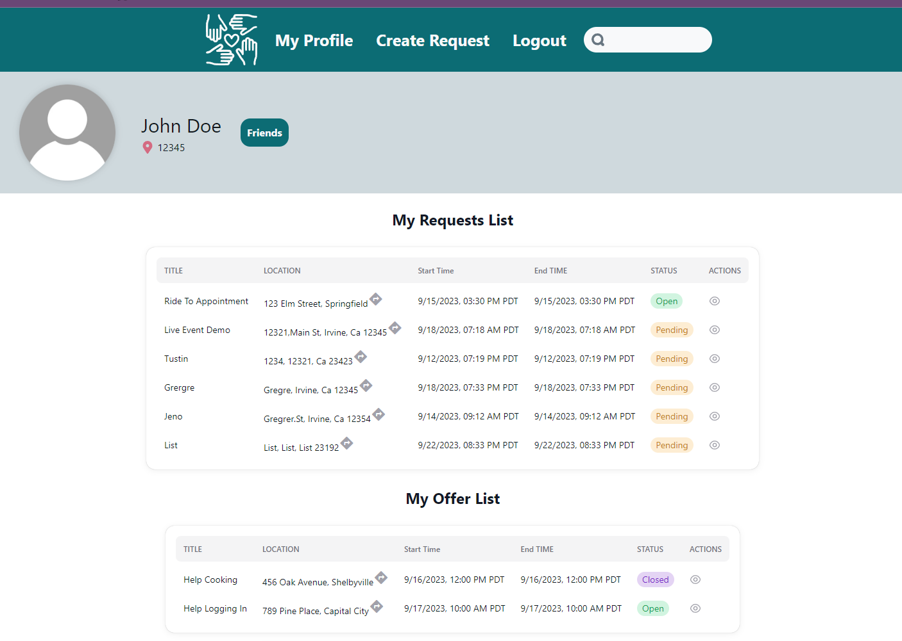
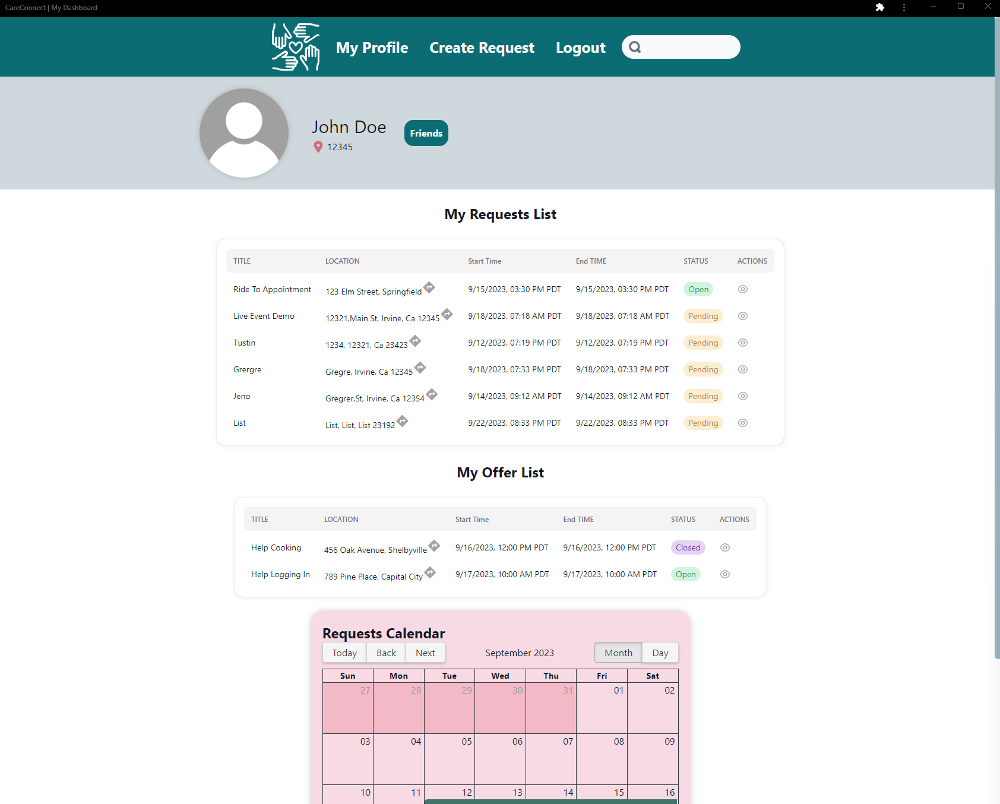
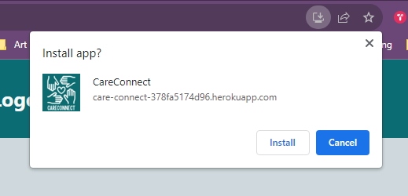


## Collaborators

Contributor Profiles:

Front-end: 
[](https://github.com/cwchilvers)
<br>
[](https://github.com/jenho-webdev)
<br>
Back-end: 
[](https://github.com/saduhub)
<br>
Features and API research:
[](https://github.com/jedichang99)

Documentations:
[](https://github.com/Kimberlyc1904)


## Contributing

Contributions are welcome! If you find any bugs or have suggestions for improvements, please open an issue or submit a pull request.

## License

This project is licensed under the MIT License.

## Disclaimer

This web app is for educational and demonstration purposes only. The app may collect and store user information such as usernames, passwords, and other data for authentication and user account management purposes.

Please note that this project may not have undergone a thorough security audit and is not intended for production use without further review and enhancement of security measures.

The creators and contributors of this project are not liable for any damages, data breaches, or misuse of information that may arise from the use of this web app.

It is the responsibility of the deployer and users of this app to ensure proper security measures are implemented and that sensitive information is handled securely.

Always exercise caution when using this or any other web application that involves personal or sensitive data.
